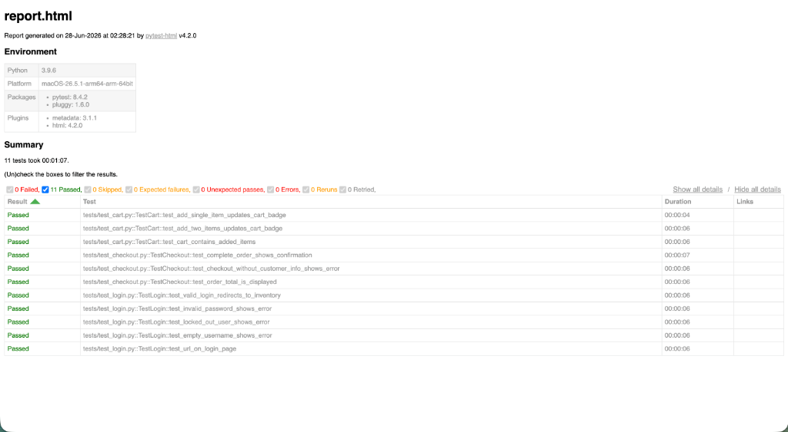

# 🤖 Sauce Demo — Selenium POM Automation

Refactored automated testing framework for [saucedemo.com](https://www.saucedemo.com) using **Selenium 4 + pytest + Page Object Model (POM)**.

---

## 🚀 Features

- 🔹 **Page Object Model (POM)** structure for clean separation of test logic and page interaction.
- 🔹 **Selenium 4 & Python** utilizing native Selenium Manager to automatically download matching drivers.
- 🔹 **Headless & Headful support** (runs Brave Browser by default on macOS, fully configurable).
- 🔹 **Robust waits** (`WebDriverWait`) replacing flaky `time.sleep()`.
- 🔹 **Beautiful HTML test reports** automatically generated after every run.

---

## 📁 Project Structure

```
Basic_automation_-of_a_website/
├── pages/
│   ├── base_page.py        # Shared helper methods (click, type, wait)
│   ├── login_page.py       # Login page actions & locators
│   ├── inventory_page.py   # Products page actions & locators
│   ├── cart_page.py        # Cart page actions & locators
│   └── checkout_page.py    # Checkout steps 1 & 2 + confirmation
├── tests/
│   ├── test_login.py       # 5 login scenarios
│   ├── test_cart.py        # 3 cart scenarios
│   └── test_checkout.py    # 3 checkout/order scenarios
├── utils/
│   └── driver_factory.py   # Webdriver configuration (configured for Brave/Chrome)
├── conftest.py             # pytest fixtures (driver, logged_in_driver)
├── pytest.ini              # pytest configuration & automatic HTML reporting
└── requirements.txt        # Project dependencies
```

---

## ⚙️ Setup Instructions

### 1. Set Up Virtual Environment
```bash
# Create a virtual environment
python3 -m venv venv

# Activate on macOS/Linux:
source venv/bin/activate
```

### 2. Install Dependencies
```bash
pip install -r requirements.txt
```

---

## ▶️ Running Tests

All tests are configured to run **headless** by default to make background executions faster and cleaner.

### Run All Tests
```bash
./venv/bin/pytest
```

### Run a Specific Test File
```bash
./venv/bin/pytest tests/test_login.py
```

### Run a Specific Test Case
```bash
./venv/bin/pytest tests/test_login.py::TestLogin::test_valid_login_redirects_to_inventory
```

---

## 📊 Viewing HTML Reports

After executing the tests, an interactive HTML report is automatically generated at the root of the project.

To open the report from your terminal:
```bash
open report.html
```

### Report Screenshot


---

## 🔧 Browser Customization

The driver factory utilizes **Brave Browser** by default (Chromium-based) on macOS. You can customize the driver binary location or toggle headless mode:

- **Toggle Headless Mode:** Modify the `driver` fixture inside [conftest.py](file:///Users/nitrozeus/WORK/SauceDemoAutomation/Basic_automation_-of_a_website/conftest.py):
  ```python
  driver = get_driver(headless=False)  # Set to False to view the browser window
  ```
- **Change Browser Binary Path:** Update the binary path in [utils/driver_factory.py](file:///Users/nitrozeus/WORK/SauceDemoAutomation/Basic_automation_-of_a_website/utils/driver_factory.py):
  ```python
  options.binary_location = "/Applications/Brave Browser.app/Contents/MacOS/Brave Browser"
  ```
